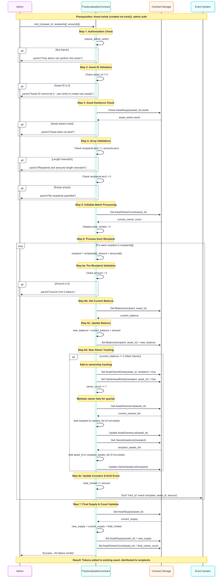
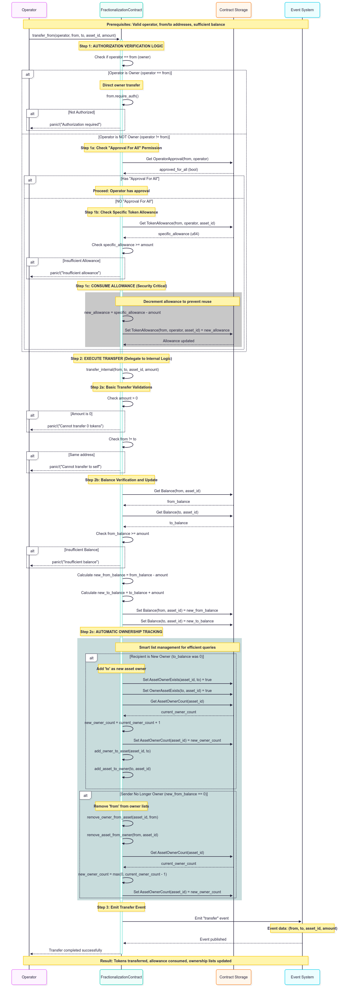

# Fractionalization Core Contract

A Soroban smart contract implementing ERC-1155 compatible fractional NFTs for real-world asset tokenization on Stellar.

## Overview

The Fractional NFT Contract is the core component of the Koltena platform, enabling the creation and management of fractional ownership tokens for real-world assets. Each asset can be divided into any number of fungible tokens, representing proportional ownership shares.

## Module Structure

The Funding contract is organized into the following modular structure for maintainability and clarity:

```
src/
├── lib.rs                   # Main entry point and module exports
├── contract.rs             # Contract struct and public interface
├── storage/
│   └── mod.rs              # Storage keys (DataKey enum)
├── events/
│   └── mod.rs              # Event emission functions
├── methods/
│   ├── mod.rs              # Module declarations
│   ├── admin.rs           # Admin management functions
│   ├── approval.rs        # Approval and allowance functions
│   ├── balance.rs         # Balance and supply queries
│   ├── metadata.rs        # URI and metadata functions
│   ├── mint.rs            # Minting and initialization
│   ├── ownership.rs       # Ownership tracking functions
│   ├── transfer.rs        # Transfer functions
│   └── utils.rs           # Utility and internal functions
└── tests/
    ├── mod.rs             # Test module declarations
    ├── unit_tests.rs      # Unit tests for individual functions
    └── integration_tests.rs # Full workflow tests
```

## Key Features

### 1. **Multi-Token Standard (ERC-1155 Compatible)**
- Single contract manages multiple asset types
- Each asset has a unique ID and custom token supply
- Efficient batch operations for multiple tokens/recipients
- Full compatibility with standard token interfaces

### 2. **Asset Creation & Management**
- Create new fractional assets with custom token supplies
- Mint tokens to single or multiple recipients
- Automatic asset ID assignment and tracking
- Asset metadata support with URI storage

### 3. **Efficient Ownership Tracking**
- O(1) balance lookups for any owner/asset combination
- Automatic cleanup of zero-balance holders
- Efficient iteration over asset owners
- Owner count tracking for analytics

### 4. **Approval & Transfer System**
- Token-specific allowances for controlled transfers
- Operator approval for all tokens
- Secure transfer functions with authorization checks
- Batch transfer capabilities

### 5. **Cross-Contract Integration**
- Provides ownership data to trading and funding contracts
- Asset existence verification
- Real-time ownership percentage calculations
- Integration-friendly view functions

## Core Functions

### Asset Creation
```rust
pub fn mint(env: Env, to: Address, num_tokens: u64) -> u64
```
Create a new fractional asset and mint all tokens to a single recipient.

```rust
pub fn mint_to(env: Env, asset_id: u64, recipients: Vec<Address>, amounts: Vec<u64>)
```
Mint additional tokens of an existing asset to multiple recipients.


### Balance & Ownership Queries
```rust
pub fn balance_of(env: Env, owner: Address, asset_id: u64) -> u64
pub fn balance_of_batch(env: Env, owners: Vec<Address>, asset_ids: Vec<u64>) -> Vec<u64>
pub fn asset_owners(env: Env, asset_id: u64) -> Vec<Address>
pub fn owner_assets(env: Env, owner: Address) -> Vec<u64>
```

### Transfer Functions
```rust
pub fn transfer(env: Env, from: Address, to: Address, asset_id: u64, amount: u64)
pub fn transfer_from(env: Env, operator: Address, from: Address, to: Address, asset_id: u64, amount: u64)
```


```rust
pub fn batch_transfer_from(env: Env, operator: Address, from: Address, to: Vec<Address>, asset_ids: Vec<u64>, amounts: Vec<u64>)
```

### Approval Management
```rust
pub fn approve(env: Env, owner: Address, operator: Address, asset_id: u64, amount: u64)
pub fn set_approval_for_all(env: Env, owner: Address, operator: Address, approved: bool)
pub fn allowance(env: Env, owner: Address, operator: Address, asset_id: u64) -> u64
pub fn is_approved_for_all(env: Env, owner: Address, operator: Address) -> bool
```

### Asset Information
```rust
pub fn asset_supply(env: Env, asset_id: u64) -> u64
pub fn asset_exists(env: Env, asset_id: u64) -> bool
pub fn get_asset_owner_count(env: Env, asset_id: u64) -> u32
pub fn next_asset_id(env: Env) -> u64
```

## Usage Examples

### 1. Basic Asset Creation
```rust
// Create a rental property with 1000 shares
let property_asset_id = client.mint(&owner_address, &1000);

// Result: Returns asset_id (e.g., 1) representing the property
// Owner now holds 1000 tokens = 100% ownership
```

### 2. Distribute to Multiple Investors
```rust
// Distribute property tokens to 3 investors
let recipients = vec![&env, investor1, investor2, investor3];
let amounts = vec![&env, 300, 400, 300]; // 30%, 40%, 30%

client.mint_to(&property_asset_id, &recipients, &amounts);

// Result: 
// - investor1: 300 tokens (30% ownership)
// - investor2: 400 tokens (40% ownership) 
// - investor3: 300 tokens (30% ownership)
```

### 3. Enable Trading
```rust
// Investor1 approves trading contract to transfer their tokens
client.approve(&investor1, &trading_contract, &property_asset_id, &100);

// Trading contract can now transfer up to 100 tokens on behalf of investor1
```

### 4. Query Ownership
```rust
// Check who owns the asset
let owners = client.asset_owners(&property_asset_id);
// Returns: [investor1, investor2, investor3]

// Check individual balances
let balance = client.balance_of(&investor1, &property_asset_id);
// Returns: 300 (tokens owned by investor1)

// Check total supply
let total = client.asset_supply(&property_asset_id);
// Returns: 1000 (total tokens for this asset)
```

## Storage Architecture

The contract uses efficient key-value storage optimized for Soroban:

### Core Data
- `Admin`: Contract administrator address
- `NextAssetId`: Counter for generating unique asset IDs

### Balance Tracking
- `Balance(owner, asset_id)`: Token balance for each owner/asset pair
- `AssetSupply(asset_id)`: Total token supply for each asset

### Ownership Optimization
- `AssetOwnerExists(asset_id, owner)`: Fast ownership checks
- `AssetOwnersList(asset_id)`: List of current owners (auto-cleanup)
- `AssetOwnerCount(asset_id)`: Number of owners for analytics

### Authorization
- `OperatorApproval(owner, operator)`: Approval for all tokens
- `TokenAllowance(owner, operator, asset_id)`: Token-specific allowances

### Metadata
- `AssetURI(asset_id)`: Metadata URI for each asset
- `AssetCreator(asset_id)`: Creator address for each asset

## Events

The contract emits events for all major operations:

- `mint`: New asset creation and token minting
- `transfer`: Token transfers between addresses
- `approval`: Allowance approvals and updates
- `uri`: Metadata URI updates

## Integration with Other Contracts

### Trading Contract Integration
```rust
// Trading contract checks ownership before allowing sales
if fnft_client.owns_asset(&seller, &asset_id) {
    // Allow trade setup
}

// Verify token balance for sale amount
let balance = fnft_client.balance_of(&seller, &asset_id);
if balance >= sale_amount {
    // Proceed with sale
}
```

### Funding Contract Integration
```rust
// Funding contract gets all owners for distribution
let owners = fnft_client.asset_owners(&asset_id);
let total_supply = fnft_client.asset_supply(&asset_id);

for owner in owners {
    let balance = fnft_client.balance_of(&owner, &asset_id);
    let percentage = (balance * 100) / total_supply;
    // Distribute funds proportionally
}
```

## Security Features

- **Authorization Checks**: All transfers require proper authorization
- **Overflow Protection**: Safe arithmetic operations
- **Access Control**: Admin-only functions for critical operations
- **State Validation**: Comprehensive input validation
- **Automatic Cleanup**: Removes zero-balance owners automatically

## Development Status

**✅ Production Ready**
- Complete ERC-1155 implementation
- Efficient ownership tracking
- Cross-contract integration interfaces
- Comprehensive test coverage
- Gas-optimized operations

**🚀 Key Benefits Over EVM**
- **Lower Gas Costs**: More efficient than Ethereum for batch operations
- **Better Performance**: O(1) lookups vs nested mapping traversals
- **Automatic Cleanup**: No need for manual owner list maintenance
- **Native Integration**: Built for Stellar ecosystem

## Possible Features

### Batch Operations
Efficient processing of multiple tokens/recipients in single transactions:

```rust
// Transfer multiple assets to different recipients in one call
client.batch_transfer_from(
    &operator,
    &from,
    &vec![&env, recipient1, recipient2],
    &vec![&env, asset1, asset2], 
    &vec![&env, 100, 200]
);
```

### Dynamic Ownership Tracking
Automatic maintenance of owner lists without manual intervention:

```rust
// When balance becomes 0, owner is automatically removed from asset_owners()
// When balance becomes > 0, owner is automatically added to asset_owners()
```

### Metadata Management
Support for asset metadata and URIs:

```rust
// Set metadata URI for an asset
client.set_asset_uri(&admin, &asset_id, &"https://example.com/asset1.json");
```
