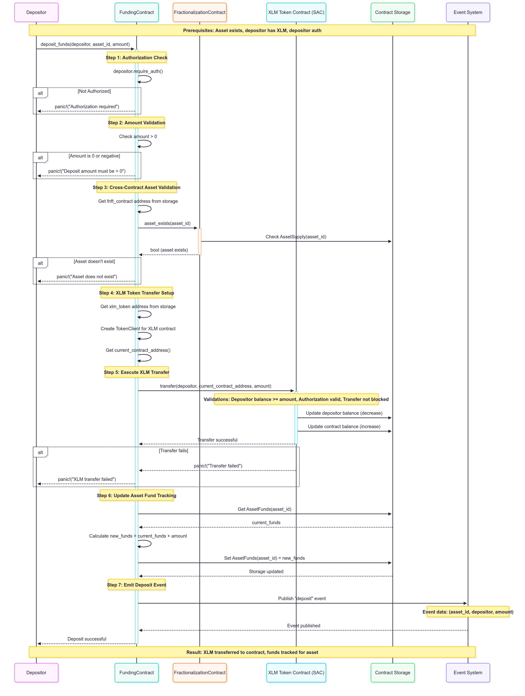
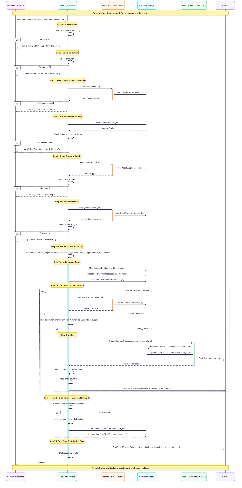

# Funding Contract

A Soroban smart contract for managing and distributing XLM funds to fractional NFT (FNFT) token holders based on their ownership percentages.

## Overview

The Funding Contract is designed to work alongside the FNFT Contract to enable revenue distribution to fractional asset owners. It handles:

- **XLM Deposits**: Accept XLM deposits for specific assets
- **Proportional Distribution**: Distribute funds to FNFT token holders based on their ownership percentage
- **Access Control**: Admin and owner-based permissions for distributions
- **Emergency Functions**: Admin emergency withdrawal capabilities

## Module Structure

The Funding contract is organized into the following modular structure for maintainability and clarity:

```
src/
├── lib.rs                    # Main entry point with module declarations
├── contract.rs               # Contract implementation and client generation
├── storage/
│   └── mod.rs               # Data structures and storage management
├── events/
│   └── mod.rs               # Event definitions and emission
├── interfaces/
│   └── mod.rs               # External contract interfaces (FNFT)
├── methods/
│   ├── mod.rs               # Method module organization
│   ├── admin.rs             # Admin functions (emergency_withdraw, transfer_admin)
│   ├── distribution.rs      # Fund distribution logic (distribute_funds, owner_distribute_funds)
│   ├── funds.rs             # Fund management (deposit_funds)
│   ├── initialization.rs    # Contract initialization
│   ├── queries.rs           # View functions (asset_funds, can_distribute, etc.)
│   └── utils.rs             # Utility functions and validations
└── tests/
    ├── mod.rs               # Test module organization
    ├── unit_tests.rs        # Comprehensive unit tests
    └── integration_tests.rs # Integration test placeholder
```

### Module Purposes

- **storage/**: Contains all data structures, storage keys, and state management
- **events/**: Centralizes event definitions for deposits, distributions, and admin actions
- **interfaces/**: External contract interfaces for cross-contract calls
- **methods/**: Business logic organized by functional area
  - `admin.rs`: Administrative functions requiring elevated permissions
  - `distribution.rs`: Core distribution algorithms and proportional payout logic
  - `funds.rs`: Fund deposit and balance management
  - `initialization.rs`: Contract setup and configuration
  - `queries.rs`: Read-only functions for contract state inspection
  - `utils.rs`: Shared utility functions and validation logic
- **tests/**: Comprehensive test suite covering all contract functionality

## Architecture

### Initialization
```rust
pub fn initialize(env: Env, admin: Address, fnft_contract: Address, xlm_token: Address)
```
Initialize the contract with admin, FNFT contract, and XLM token contract addresses.

### Deposits
```rust
pub fn deposit_funds(env: Env, depositor: Address, asset_id: u64, amount: i128)
```
Deposit XLM for a specific asset. The contract transfers XLM from depositor to itself and tracks the balance.


### Distributions
```rust
pub fn distribute_funds(env: Env, caller: Address, asset_id: u64, amount: u128, description: String)
```
Distribute XLM from contract to asset owners proportionally (admin only). **Performs XLM transfers**.

```rust
pub fn owner_distribute_funds(env: Env, caller: Address, asset_id: u64, amount: u128, description: String)
```
Allow asset owners to initiate distributions (requires ownership). 

**Performs XLM transfers**.


### View Functions
```rust
pub fn asset_funds(env: Env, asset_id: u64) -> u128
pub fn total_distributed(env: Env, asset_id: u64) -> u128
pub fn get_distribution_count(env: Env, asset_id: u64) -> u32
pub fn can_distribute(env: Env, caller: Address, asset_id: u64) -> bool
pub fn get_xlm_token_address(env: Env) -> Address
```

## Usage Examples

### Basic Flow
1. **Asset Creation**: Create fractionalized asset in FNFT contract
2. **Fund Deposit**: Deposit XLM which transfers from depositor to funding contract
3. **Distribution**: Admin or owners trigger distribution with XLM transfers
4. **Automatic Payout**: XLM distributed proportionally from contract to token holders

### Revenue Distribution Scenario
```rust
// 1. Asset exists with 1000 total tokens
// User A owns 300 tokens (30%)
// User B owns 700 tokens (70%)

// 2. Initialize contracts
let xlm_token = deploy_xlm_sac_contract();
funding_contract.initialize(&admin, &fnft_contract, &xlm_token);

// 3. Deposit $1000 XLM in revenue (real transfer: depositor -> contract)
funding_contract.deposit_funds(&admin, &asset_id, &100000000i128); // 1000 XLM

// 4. Distribute to owners (real transfers: contract -> owners)
funding_contract.distribute_funds(&admin, &asset_id, &100000000u128, &"Monthly rent");

// 5. Results (actual XLM transfers executed):
// User A receives: 30,000,000 stroops (300 XLM) in their wallet
// User B receives: 70,000,000 stroops (700 XLM) in their wallet
```

## Events

The contract emits several events for tracking:

- `init`: Contract initialization (includes XLM token address)
- `deposit`: Fund deposits (with XLM transfers)
- `distrib`: Distribution execution (with XLM transfers)
- `received`: Individual payments to owners (actual transfers)
- `admin`: Admin role transfers
- `emergency`: Emergency withdrawals

## Security Features

- **Access Control**: Admin and ownership verification
- **Asset Validation**: Ensures assets exist before operations
- **Balance Checks**: Prevents over-distribution
- **Emergency Controls**: Admin emergency withdrawal
- **Audit Trail**: Comprehensive event logging

## Development Status

**Current Implementation**: 
- ✅ Core distribution logic
- ✅ Access control
- ✅ Integration with FNFT contract
- ✅ Comprehensive test suite
- ✅ **XLM transfers via SAC interface**
- ✅ Contract holds and manages actual XLM balances

**Production Ready Features**:
- Real XLM deposit and distribution functionality
- Cross-contract integration with FNFT ownership data
- Proportional distribution with dust handling
- Emergency admin controls and fund recovery

**Future Enhancements**:
- Gas optimization for large owner lists
- Implement batch distribution for efficiency
- Add governance voting mechanisms
- Integration with gaming team SAC architecture

