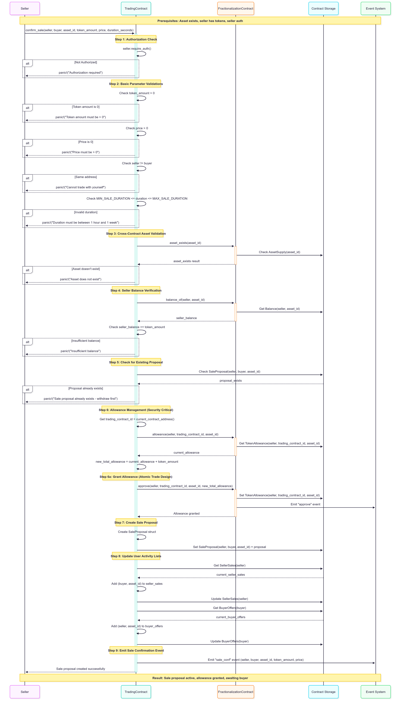
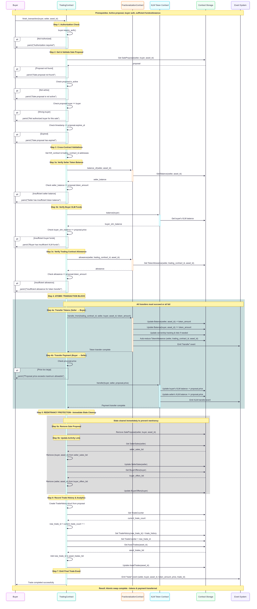
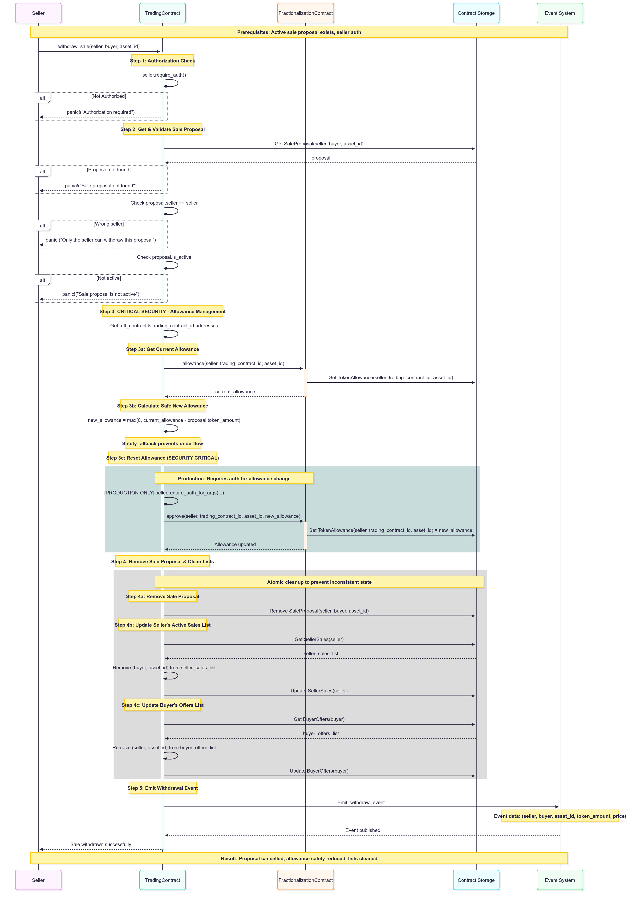

# Trading Contract

A Soroban smart contract enabling secure peer-to-peer trading of fractional NFT tokens with XLM settlements on Stellar.

## Overview

The Trading Contract facilitates direct trading between users who want to exchange fractional asset tokens for XLM. It implements a confirmed sale system where both parties must agree to the trade terms, ensuring secure and transparent transactions.

## Module Structure

The Trading contract is organized into the following modular structure for maintainability and clarity:

```
src/
├── lib_modular.rs           # Main entry point with module declarations
├── contract.rs              # Contract implementation and public interface
├── storage/
│   └── mod.rs              # Data structures, storage keys, and constants
├── events/
│   └── mod.rs              # Event definitions and emission functions
├── interfaces/
│   └── mod.rs              # External contract interfaces (FNFT)
├── methods/
│   ├── mod.rs              # Method module organization
│   ├── initialization.rs   # Contract initialization
│   ├── sales.rs            # Sale proposal management
│   ├── transactions.rs     # Trade execution and completion
│   ├── queries.rs          # View functions and data retrieval
│   └── utils.rs            # Utility functions and helpers
└── tests/
    ├── mod.rs              # Test module organization
    ├── unit_tests.rs       # Unit tests for individual functions
    └── integration_tests.rs # Complete trading workflow tests
```

### Module Purposes

- **storage/**: Contains data structures (SaleProposal, TradeHistory), storage keys (DataKey enum), and trading constants
- **events/**: Centralizes event definitions for sales, trades, withdrawals, and administrative actions
- **interfaces/**: External contract interfaces for cross-contract calls to FNFT contract
- **methods/**: Business logic organized by functional area
  - `initialization.rs`: Contract setup and configuration
  - `sales.rs`: Sale proposal creation, withdrawal, and management
  - `transactions.rs`: Trade execution and atomic XLM-token swaps
  - `queries.rs`: Read-only functions for proposals, history, and analytics
  - `utils.rs`: Shared utility functions and internal helpers
- **tests/**: Comprehensive test suite covering all trading functionality

## Key Features

### 1. **Confirmed Sale System**
- Both seller and buyer must explicitly agree to trade terms
- Prevents unintended transactions and disputes
- Time-limited offers with automatic expiration
- Transparent negotiation process

### 2. **Atomic XLM Settlements**
- Real XLM transfers using Stellar Asset Contract (SAC) interface
- Atomic token-for-XLM swaps
- No intermediate tokens or complex wrapping
- Direct integration with Stellar's native asset

### 3. **Comprehensive Trade Management**
- Create, modify, and cancel sale proposals
- Automatic handling of expired offers
- Emergency functions for stuck transactions
- Complete audit trail of all trades

### 4. **Cross-Contract Integration**
- Seamless integration with F-NFT contract for token operations
- Automatic ownership verification
- Token allowance management
- Real-time balance checks

### 5. **Trading Analytics**
- Complete trading history storage
- Asset-specific trade tracking
- User trading activity monitoring
- Market activity analytics

## Core Functions

### Sale Management
```rust
pub fn confirm_sale(env: Env, seller: Address, buyer: Address, asset_id: u64, token_amount: u64, price: u128, duration_hours: u64)
```
Create a new sale proposal with specified terms that both parties must confirm.



```rust
pub fn finish_transaction(
    env: Env, 
    buyer: Address, 
    seller: Address, 
    asset_id: u64,
    expected_token_amount: u64,  
    expected_price: u128         
    )
```
Complete a confirmed sale by executing the token-for-XLM swap with buyer protection against proposal tampering.



```rust
pub fn withdraw_sale(env: Env, seller: Address, buyer: Address, asset_id: u64)
```
Cancel an active sale proposal (seller only).



### Trade Queries
```rust
pub fn get_sale_proposal(env: Env, seller: Address, buyer: Address, asset_id: u64) -> SaleProposal
pub fn sale_exists(env: Env, seller: Address, buyer: Address, asset_id: u64) -> bool
pub fn get_seller_sales(env: Env, seller: Address) -> Vec<(Address, u64)>
pub fn get_buyer_offers(env: Env, buyer: Address) -> Vec<(Address, u64)>
```

### Trading History
```rust
pub fn get_trade_history(env: Env, trade_id: u32) -> TradeHistory
pub fn get_trade_count(env: Env) -> u32
pub fn get_asset_trades(env: Env, asset_id: u64) -> Vec<u32>
```

### Utility Functions
```rust
pub fn time_until_expiry(env: Env, seller: Address, buyer: Address, asset_id: u64) -> u64
pub fn cleanup_expired_sale(env: Env, seller: Address, buyer: Address, asset_id: u64)
pub fn get_current_allowance(env: Env, seller: Address, asset_id: u64) -> u64
```

## Trading Flow

### 1. **Initiate Sale**
```rust
// Seller creates a sale proposal
// Example: Sell 100 tokens for 1000 XLM, expires in 24 hours
client.confirm_sale(
    &seller_address,
    &buyer_address,
    &asset_id,
    &100,           // token_amount
    &100000000,     // price in stroops (1000 XLM)
    &24             // duration_hours
);
```

### 2. **Buyer Accepts**
```rust
// Buyer completes the purchase with expected terms for security
// This transfers XLM to seller and tokens to buyer
client.finish_transaction(
    &buyer_address,
    &seller_address,
    &asset_id,
    &100,           // expected_token_amount (security check)
    &100000000      // expected_price (security check)
);
```

### 3. **Automatic Settlement**
The contract automatically:
- Transfers tokens from seller to buyer
- Transfers XLM from buyer to seller
- Records the transaction in trading history
- Updates all relevant tracking data

## Data Structures

### SaleProposal
```rust
pub struct SaleProposal {
    pub seller: Address,
    pub buyer: Address,
    pub asset_id: u64,
    pub token_amount: u64,
    pub price: u128,
    pub is_active: bool,
    pub timestamp: u64,
    pub expires_at: u64,
}
```

### TradeHistory
```rust
pub struct TradeHistory {
    pub seller: Address,
    pub buyer: Address,
    pub asset_id: u64,
    pub token_amount: u64,
    pub price: u128,
    pub timestamp: u64,
}
```

## Usage Examples

### Example 1: Basic Trading
```rust
// Setup: investor1 wants to sell 100 tokens to investor2 for 1000 XLM

// Step 1: Investor1 approves trading contract
fnft_client.approve(&investor1, &trading_contract, &asset_id, &100);

// Step 2: Create sale proposal
trading_client.confirm_sale(
    &investor1,     // seller
    &investor2,     // buyer
    &asset_id,      // property tokens
    &100,           // 100 tokens
    &100000000,     // 1000 XLM (in stroops)
    &24             // 24 hours expiry
);

// Step 3: Buyer completes purchase with security validation
trading_client.finish_transaction(
    &investor2,     // buyer
    &investor1,     // seller
    &asset_id,      // property tokens
    &100,           // expected_token_amount (prevents tampering)
    &100000000      // expected_price (prevents bait-and-switch)
);

// Result: 
// - investor1 receives 1000 XLM
// - investor2 receives 100 tokens
// - Trade recorded in history
```

### Example 2: Market Activity Tracking
```rust
// Check all active sales for a user
let sales = trading_client.get_seller_sales(&investor1);
// Returns: [(buyer_address, asset_id), ...]

// Get trading history for an asset
let asset_trades = trading_client.get_asset_trades(&asset_id);
// Returns: [trade_id1, trade_id2, ...]

// Get details of a specific trade
let trade = trading_client.get_trade_history(&trade_id);
// Returns: TradeHistory struct with all details
```

### Example 3: Sale Management
```rust
// Check if a sale exists
let exists = trading_client.sale_exists(&seller, &buyer, &asset_id);

// Get sale details
let proposal = trading_client.get_sale_proposal(&seller, &buyer, &asset_id);

// Check time until expiry
let time_left = trading_client.time_until_expiry(&seller, &buyer, &asset_id);

// Cancel a sale (seller only)
trading_client.withdraw_sale(&seller, &buyer, &asset_id);
```

## Security Features

### 1. **Authorization Controls**
- Only sellers can create/cancel sales
- Only buyers can complete purchases
- Automatic verification of token ownership
- Balance checks before allowing sales

### 2. **Buyer Protection Against Tampering**
- Buyers must specify expected terms when completing transactions
- Prevents bait-and-switch attacks where sellers modify proposals
- Guards against race conditions during proposal execution
- Validates exact token amount and price match buyer's expectations

### 3. **Expiration Management**
- All sales have mandatory expiration times
- Automatic cleanup of expired offers
- Configurable duration limits (1 hour to 1 week)
- Prevention of indefinite market clutter

### 4. **State Validation**
- Comprehensive input validation
- Asset existence verification
- Sufficient balance checks
- Allowance verification before transfers

### 5. **Emergency Functions**
- Admin can reset stuck allowances
- Cleanup functions for expired sales
- Emergency withdrawal capabilities
- Audit trail preservation

## Events

The contract emits events for all trading activities:

- `sale_created`: New sale proposal created
- `sale_completed`: Trade successfully executed
- `sale_cancelled`: Sale proposal withdrawn
- `trade_recorded`: Transaction added to history

## Integration Points

### F-NFT Contract Integration
```rust
// Verify asset exists
if !fnft_client.asset_exists(&asset_id) {
    panic!("Asset does not exist");
}

// Check seller balance
let balance = fnft_client.balance_of(&seller, &asset_id);
if balance < token_amount {
    panic!("Insufficient tokens");
}

// Execute token transfer
fnft_client.transfer_from(&trading_contract, &seller, &buyer, &asset_id, &token_amount);
```

### XLM Token Integration
```rust
// Execute XLM payment
xlm_client.transfer(&buyer, &seller, &price_in_stroops);
```

## Error Handling

The contract includes comprehensive error handling:

- `"Asset does not exist"`: Invalid asset ID
- `"Insufficient balance"`: Not enough tokens to sell
- `"Sale proposal not found"`: Invalid sale reference
- `"Sale has expired"`: Attempting to complete expired sale
- `"Unauthorized access"`: Wrong user for operation
- `"Invalid duration"`: Sale duration outside allowed range
- `"Token amount mismatch"`: Buyer's expected amount doesn't match proposal
- `"Price mismatch"`: Buyer's expected price doesn't match proposal

## Performance Optimizations

### 1. **Efficient Lookups**
- Direct key-value access for sale proposals
- Indexed storage for user activity
- Batched queries for multiple operations

### 2. **Automatic Cleanup**
- Removal of completed sales from active lists
- Periodic cleanup of expired offers
- Efficient storage management

### 3. **Gas Optimization**
- Minimal storage operations
- Efficient data structures
- Batch processing capabilities

## Development Status

**✅ Production Ready**
- Complete trading functionality
- Secure XLM settlements
- Comprehensive error handling
- Cross-contract integration
- Full audit trail

**🚀 Key Advantages**
- **Direct XLM Payments**: No wrapped tokens or complex conversions
- **Atomic Swaps**: Guaranteed token-for-XLM exchange
- **Low Fees**: Stellar network efficiency
- **Instant Settlement**: Fast transaction finality


## Possible Features

### Market Making
The contract supports market-making scenarios:

```rust
// Market maker creates multiple sale offers
for (buyer, price) in market_offers {
    trading_client.confirm_sale(&market_maker, &buyer, &asset_id, &amount, &price, &duration);
}
```

### Batch Operations
Efficient handling of multiple trades:

```rust
// Complete multiple trades in sequence with security validation
for (seller, buyer, asset_id, amount, price) in pending_trades {
    trading_client.finish_transaction(&buyer, &seller, &asset_id, &amount, &price);
}
```

### Analytics Support
Rich data for trading analytics:

```rust
// Get comprehensive trading data
let total_trades = trading_client.get_trade_count();
let asset_activity = trading_client.get_asset_trades(&asset_id);
let user_sales = trading_client.get_seller_sales(&user);
```
